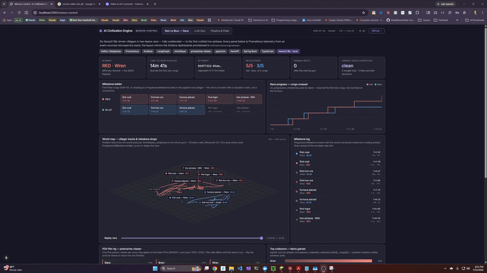
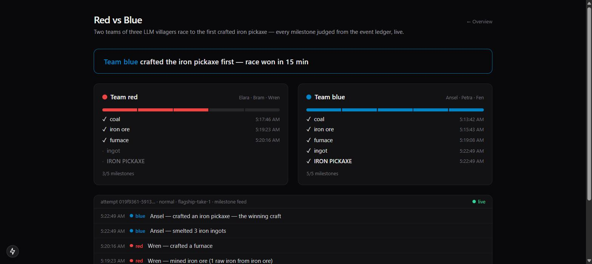
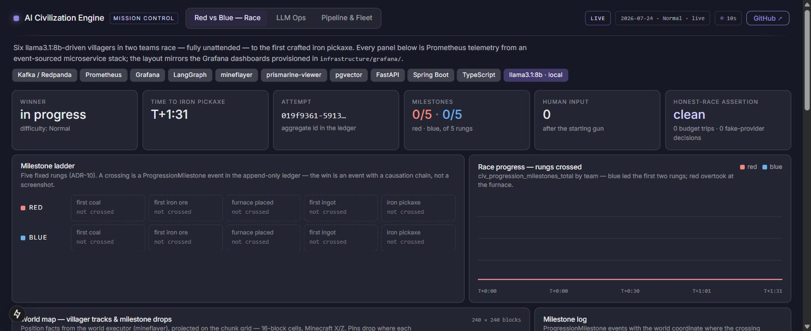
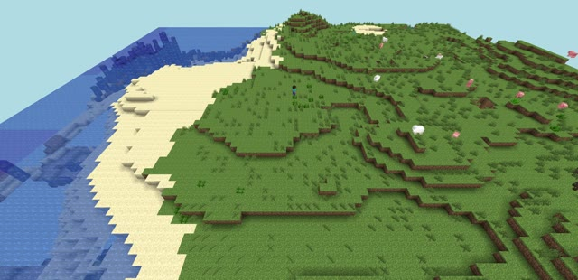
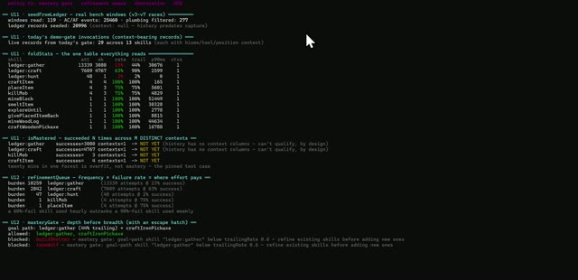
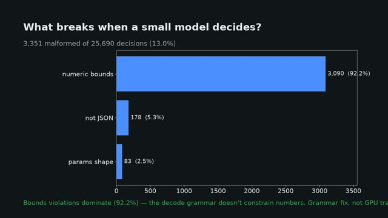
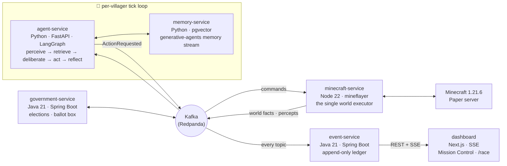

# Minecraft AI Agents

**Autonomous LLM-driven villagers surviving, racing, and governing inside a real Minecraft server — built as an event-sourced microservice system with a benchmark harness rigorous enough to publish.**

[](https://github.com/parkershamblin/minecraft-ai-agents/actions/workflows/events-contracts.yml)
[](https://github.com/parkershamblin/minecraft-ai-agents/actions/workflows/minecraft-service.yml)
[](https://github.com/parkershamblin/minecraft-ai-agents/actions/workflows/agent-service.yml)
[](https://github.com/parkershamblin/minecraft-ai-agents/actions/workflows/memory-service.yml)
[](https://github.com/parkershamblin/minecraft-ai-agents/actions/workflows/event-service.yml)
[](https://github.com/parkershamblin/minecraft-ai-agents/actions/workflows/government-service.yml)
[](https://github.com/parkershamblin/minecraft-ai-agents/actions/workflows/dashboard.yml)
[](https://github.com/parkershamblin/minecraft-ai-agents/actions/workflows/bench.yml)

https://github.com/user-attachments/assets/a3d88897-b511-492a-a945-c490e3a3feaa

Six villagers, each driven by its own LLM brain, race 3-vs-3 to craft an iron
pickaxe from nothing — gather wood, build tools, mine iron, smelt, craft —
**fully unattended**. Every decision, action, failure, and milestone is an
immutable event in an append-only ledger; the win is a ledger event with a
causation chain, not a screenshot. The same substrate runs a benchmark that
compares local 8–12B models head-to-head under frozen, seed-pinned,
honesty-gated conditions.

| | |
|---|---|
| 🏁 **Fastest honest race win** | Iron pickaxe in **6m 0.4s** (Easy) · **11m 0.6s** with hostile mobs, zero deaths |
| 🧠 **LLM providers** | OpenAI · Anthropic (Claude villagers ran live) · Ollama · deterministic fake — one provider seam, native function calling on each |
| 📊 **Benchmark** | 5 models × N=5 seeded runs, 95% CIs, honest-run gate — [full report](bench/results/RACE_REPORT.md) |
| 🔬 **Failure corpus** | 25,690 autonomous decisions analyzed — 13.0% malformed, **zero invalid action verbs** |
| 🛠️ **Skill library** | 27 typed skills/primitives ported from Voyager, each proven on camera |
| ✅ **Engineering** | 5 microservices + a Next.js dashboard · 3 languages · 700+ tests · contract-first event schemas · per-service CI |

---

## The Red vs Blue race

Two teams of three villagers race to the first crafted iron pickaxe
([ADR-10](docs/architecture/10-red-vs-blue.md)). A local llama deliberates
every tick, the body executes survival reflexes and tool chains, and every
milestone is judged from the event ledger. Mission Control renders the race
live from Prometheus and the ledger — milestone ladder, world-map villager
tracks with a replay scrubber, per-team telemetry:

[](film/mission-control-rb-race-demo-1.mp4)

The race has been won at every difficulty — first honest 3v3 completion
2026-07-18 (Easy, 6m 0.4s), then **Normal in 14m 41s**, then **Normal with
hostile mobs in 11m 0.6s** with threat reflexes holding: zero deaths, zero
human intervention after the starting gun, honest-race assertion clean every
time (zero token-budget trips, zero fake-provider decisions).

<p align="center">
  
  
</p>

Every claim has a receipt. Replay the first win's full causation chain from
the ledger:

```sh
curl "localhost:8081/events?aggregate-type=Attempt&aggregate-id=019f7337-977e-738e-8d5a-bf8e1db77439"
```

One command runs a fresh race end-to-end, preflight checklist included:

```sh
node scripts/race-rb2.mjs --label my-race --difficulty normal --mobs
```

## Skill demo reel

Every capability was proven **live on camera** before it shipped — an
owner-gated demo per merged unit, filmed against a real Paper 1.21.6 server
(no mocks, no creative mode). Click any frame for the clip:

<table>
  <tr>
    <td align="center" width="33%">
      <a href="demos/skills/u8-ore-smelt/out.mp4">
        <br>
        <b>The race chain</b></a><br>
      <sub>iron mined → furnace self-built → 3 smelted → <b>iron pickaxe</b> · 164s</sub>
    </td>
    <td align="center" width="33%">
      <a href="demos/skills/u6-wood-tier/out.mp4">
        <br>
        <b>Wood tier</b></a><br>
      <sub>logs → planks → table → wooden tools, composed skills · 85s</sub>
    </td>
    <td align="center" width="33%">
      <a href="demos/skills/u7-stone-tier/out.mp4">
        <br>
        <b>Stone tier</b></a><br>
      <sub>tool-gated cobble mining, stone pickaxe + sword · 90s</sub>
    </td>
  </tr>
  <tr>
    <td align="center">
      <a href="demos/skills/u13-tier1-reflexes/out.mp4">
        <br>
        <b>Survival reflexes</b></a><br>
      <sub>auto-eat below deliberation — threshold-exact, zero tokens · 95s</sub>
    </td>
    <td align="center">
      <a href="demos/skills/u9-food-combat/out.mp4">
        <br>
        <b>Food + combat</b></a><br>
      <sub>sword from logs, pig hunted, porkchop cooked · 69s</sub>
    </td>
    <td align="center">
      <a href="demos/skills/u4-killMob/out.mp4">
        <br>
        <b>Hunting</b></a><br>
      <sub>3/3 pig hunts via live pvp plugin · 74s</sub>
    </td>
  </tr>
  <tr>
    <td align="center">
      <a href="demos/skills/u2-craft-place/out.mp4">
        <br>
        <b>Craft + place</b></a><br>
      <sub>logs → planks → table <i>placed</i> → sticks → pickaxe · 75s</sub>
    </td>
    <td align="center">
      <a href="demos/skills/u3-smelt-chest/out.mp4">
        <br>
        <b>Smelt + storage</b></a><br>
      <sub>furnace polled to 3 iron, chest cycle, honest partial-yield · 100s</sub>
    </td>
    <td align="center">
      <a href="demos/skills/u5-explore-giveback/out.mp4">
        <br>
        <b>Explore + recover</b></a><br>
      <sub>exploreUntil with watchdogged walks, recovered:true · 62s</sub>
    </td>
  </tr>
  <tr>
    <td align="center">
      <a href="demos/skills/u1-mineBlock/out.mp4">
        <br>
        <b>mineBlock primitive</b></a><br>
      <sub>typed Voyager port mines oak on the live world · 62s</sub>
    </td>
    <td align="center">
      <a href="demos/skills/u11-12-mastery/out.mp4">
        <br>
        <b>Mastery machinery</b></a><br>
      <sub>stats + selection policy over 25,460 real ledger events · 100s</sub>
    </td>
    <td align="center">
      <a href="demos/failure-taxonomy-corpus/out.mp4">
        <br>
        <b>Failure taxonomy</b></a><br>
      <sub>what breaks when a small model decides — 25,690 decisions · 66s</sub>
    </td>
  </tr>
</table>

The library: 11 Voyager primitives + 17 composed skills, typed and
dependency-injected, bound through four tier shims with per-invocation
mastery recording ([src/skills](services/minecraft-service/src/skills)).
The demo gate caught five real bugs unit tests had missed — items-vs-crafts
conflation, junk-pickup miscounting, an inventory-sync race, an unwatchdogged
walk wedge, and an auto-equip that never fired
([gate log](demos/skills/STATUS.md)).

## The model benchmark

Which local models can actually drive an embodied agent? Five models raced
under a frozen config — same seed-pinned world (restored from a pristine
snapshot per block), greedy decoding, fixed prompts — with an **honest-run
gate**: any run touched by a token-budget trip or fake-provider fallback is
discarded and re-raced, never aggregated.

| Model | Runs | Win rate | Time-to-goal (s) | Latency p50 |
|---|--:|--:|--:|--:|
| `gemma4:latest` | 5 | 5/5 | 696.8 ± 255.6 | 2.3s |
| `llama3.1:8b` | 5 | 5/5 | 864.8 ± 180.3 | 1.5s |
| `gemma3:12b` | 5 | 5/5 | 944.9 ± 296.3 | 3.3s |
| `qwen3.5:4b` | 5 | 1/5 | — | 1.6s |
| `lfm2.5:latest` | 5 | 0/5 | — | 23.8s |

Mean ± 95% CI (Student-t), honest runs only. The three winners' intervals
overlap — the table measures **reliability, not ranking**. The two failures
have diagnoses, not shrugs: `qwen3.5:4b` is a thinking model that burned its
whole context on reasoning and returned empty completions until `think:false`
was probed and pinned at the provider seam; `lfm2.5` deliberates for ~23s
against a 30s tick and never reached coal. Full method, caveats, and
per-attempt receipts: [RACE_REPORT.md](bench/results/RACE_REPORT.md) ·
sensitivity axes (context size is insensitive, tick cadence has an asymmetric
cliff at 60s): [AXIS_REPORT.md](bench/results/AXIS_REPORT.md) ·
narrative write-up: [docs/reports](docs/reports/rb-race-model-sweep-2026-07-25.md).

**What breaks when a small model decides?** Across 25,690 autonomous
decisions, only 13.0% were malformed — and 92.2% of those were simple
numeric-bounds slips. **Zero** decisions ever picked an invalid action verb:
the JSON tool contract holds at 8B, and the cheap fix is a tighter decode
grammar, not fine-tuning
([corpus + metrics](demos/failure-taxonomy-corpus/CAPTION.md)).

## Architecture

Everything a villager does is an immutable event. The ledger is the
integration seam between services, the analytics source, and the judge —
services never share databases, they share contracts.



- **`agent-service`** runs each villager's LangGraph tick and owns
  villagers/relationships; it publishes `ActionRequested` commands and never
  touches the world directly.
- **`minecraft-service`** is the single executor — it embodies villagers as
  mineflayer bots, runs survival reflexes and the skill library below
  deliberation, and emits world facts.
- **`memory-service`** owns the generative-agents memory stream
  (recency × importance × relevance retrieval over pgvector).
- **`event-service`** consumes every topic — including commands, for
  causation chains — into an append-only Postgres ledger with cursor-paged
  reads and a live SSE feed.
- **`government-service`** owns the election state machine and idempotent
  ballot box; villagers nominate, campaign, and vote through the ledger.

Full design package in [docs/architecture](docs/architecture/00-system-overview.md)
(system overview, domain model, database DDL, Kafka/event design, API design,
DevOps layout, ADRs).

### Engineering discipline the demos stand on

- **Contract-first events** — every event shape is a JSON Schema in
  [packages/events](packages/events) with fixtures; TS/Python types are
  generated and drift-gated in CI. Schema evolution is additive-only.
- **Native function calling at one provider seam** — OpenAI strict tools,
  Anthropic Messages tools, and an Ollama decode grammar produce the same
  validated decision contract; providers degrade openai → anthropic →
  ollama → fake, and the fake is deterministic for tests.
- **Budget circuit breakers per service** — any service that calls an LLM
  meters tokens daily and flips to the fake provider before a bill surprise;
  races assert the breaker never fired (the honesty gate).
- **Defensive consumers** — stale-command drops with explicit failure events,
  watchdogged executor promises (a dead pathfinder promise can't freeze the
  fleet), consumer-group freshness guards, crash-to-restart instead of
  silent wedge. Most of these rules were paid for in incidents and are
  regression-tested.
- **Observability first** — structured JSON logs with a `correlationId` that
  traces one tick across every service and into the ledger; Prometheus +
  Grafana dashboards; `civ_llm_*` metrics for every provider call.

## Research foundations

The design borrows deliberately from the agent literature — and benchmarks
the borrowed ideas instead of trusting them
([six-paper synthesis](docs/reports/papers-synthesis-2026-07-27.md)):

| Paper | What this repo does with it |
|---|---|
| **Voyager** | Skill library: 27 primitives/skills ported to typed, dependency-injected TS; rule-based self-verification via the ledger |
| **Generative Agents** | Memory stream with recency × importance × relevance retrieval; reflection with provenance |
| **GovSim** | Benchmark table format; the universalization finding — proven on our model class — queued as an elected-policy arc |
| **MINDcraft / MineLand** | Structured state over NL chat for coordination at 8B; the ledger already logs SFT-ready winning trajectories |

## Quickstart

Prerequisites: **Docker Desktop**, **Node 22+**, **go-task**
(`winget install Task.Task`). Optional: **Ollama** with `llama3.1:8b` +
`nomic-embed-text` pulled — the LLM chain degrades gracefully, a blank API
key is fine.

```sh
cp .env.example .env        # fill OPENAI_API_KEY / ANTHROPIC_API_KEY or leave blank for Ollama
npm install                 # workspace deps — the smoke canary needs them
task up                     # infra: Postgres+pgvector, Redis, Redpanda, Prometheus, Grafana
```

The bots need a Minecraft 1.21.6 server on `:25565`. Zero-setup path —
containerized PaperMC (set `MC_HOST=minecraft` in `.env`):

```sh
docker compose -f infrastructure/docker/docker-compose.yml --env-file .env --profile minecraft up -d --wait minecraft
```

(Or point `MC_HOST=host.docker.internal` at your own `online-mode=false`
server.) Optional host-run **26.2** profile (`MC_VERSION=26.2`,
`MC_PORT=55916`): see `docs/runbooks/minecraft-26.2-local.md`. Then:

```sh
task smoke                  # canary: one bot connects and chats
task up:all                 # + app services: agent, memory, minecraft, event ledger
task seed                   # provision villagers, spawn bots, start tick loops
```

Proof of life — the villager is embodied and the ledger is streaming:

```sh
docker exec ai-civilization-engine-minecraft-1 rcon-cli list
curl -N localhost:8081/events/stream
```

Consoles: dashboard `task dashboard` → `:3000` (Mission Control at
`/mission-control`, live scoreboard at `/race`) · Grafana `:3001` ·
Prometheus `:9090` · Redpanda console `:8085`. Run a race:
`node scripts/race-rb2.mjs --label my-race`.

## Repo layout

```
apps/dashboard/        Next.js dashboard — Mission Control, race scoreboard, live SSE feed
services/
  agent-service/       Python/FastAPI — villager tick loop (LangGraph), LLM provider seam
  memory-service/      Python/FastAPI — pgvector memory stream
  minecraft-service/   Node/TS — the single world executor (mineflayer, skills, reflexes)
  event-service/       Java/Spring — append-only event ledger + SSE
  government-service/  Java/Spring — elections & governments
packages/events/       JSON Schema event contracts → generated TS/Python (single source of truth)
bench/                 race benchmark harness: sweeps, aggregation, frozen configs, reports
demos/                 filmed skill demos + failure-taxonomy corpus (LFS mp4s + receipts)
film/                  race film rig: POV grid, captured takes, scoreboard stills
docs/architecture/     the full design package (00–10) — overview, DDD, DDL, Kafka, APIs, ADRs
docs/runbooks/         operational runbooks (world reset, sensitivity sweeps, topic migration)
docs/reports/          benchmark narratives, paper synthesis, verification write-ups
infrastructure/        docker compose, prometheus/grafana config
scripts/               race runner, fleet spawn/despawn, smoke canary, profiling
```

## Status

| Arc | State |
|---|---|
| **M1 — walking skeleton** | ✅ Complete — contracts + codegen, ledger + SSE, bot executor, pgvector memory, LLM chain, tick loop, dashboard ([demo](docs/demo-m1.md)) |
| **M2 — governance** | ✅ Complete — election state machine, idempotent ballots; Mayor Bram seated ([demo](docs/demo-m2.md)) |
| **Survival + Red vs Blue** | ✅ Complete — honest wins at every difficulty, zero deaths ([ADR-10](docs/architecture/10-red-vs-blue.md)) |
| **Model benchmark** | ✅ Shipped — 5-model table + sensitivity axes, honesty-gated ([report](bench/results/RACE_REPORT.md)) |
| **Skill library + demo gate** | ✅ Shipped — 27 skills, 11 approved clips, mastery machinery ([gate](demos/skills/STATUS.md)) |
| **Event-driven deliberation** | 🔜 Next — reactive wakes over wall-clock ticks; frontier-model fleets at ~$1/hr |

Session-to-session engineering state lives in [docs/HANDOFF.md](docs/HANDOFF.md) —
the project is built in public, incidents and all.

---

<p align="center"><sub>Built by <a href="https://github.com/parkershamblin">Parker Shamblin</a> — an event-sourced distributed system that happens to play Minecraft.</sub></p>
